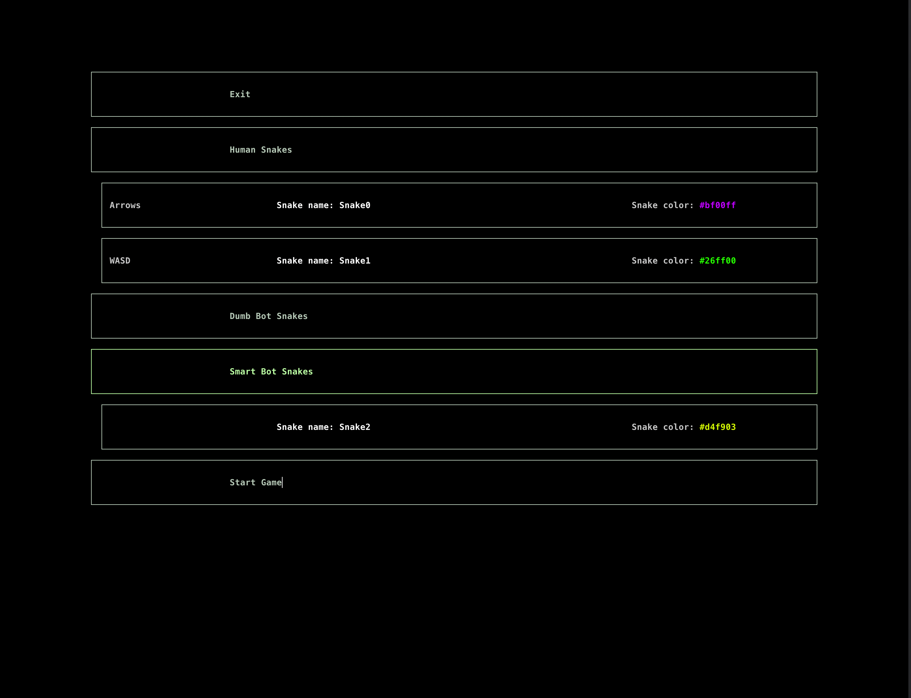
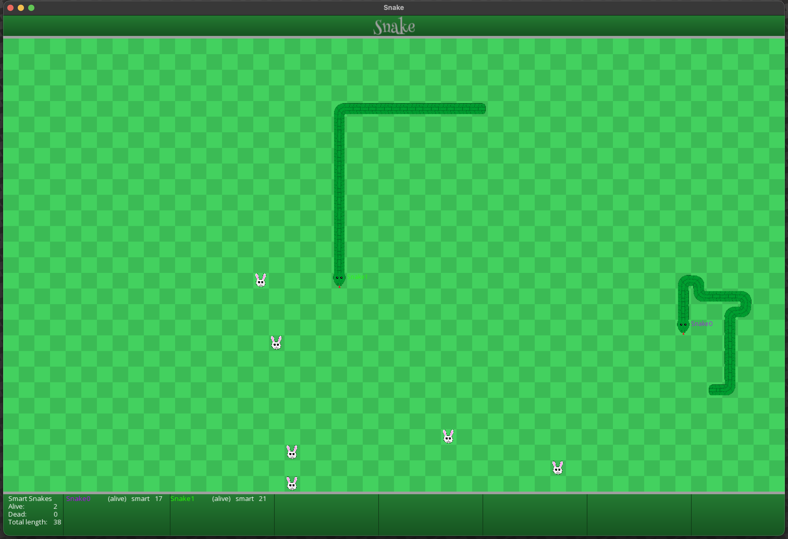

# Snake

## Development plan

[x] Create minimal compiling version with ascii view and human snakes.

[x] Add simple dumb bots which will go to closest rabbit

[x] Add bot which will go to closest accessible rabbit

[x] Add SFML graphics view

[x] Get statistics with different runs

[ ] TODO add more bots in this plan

## Statistics of PvE runs:

Multiple bots play alone on the field, collecting food. Each bot runs independently, and their final scores are recorded. The results are visualized as a histogram showing the distribution of total scores across all runs.


## Statistics of PvP runs:

Two snakes are placed on the same field, each controlled by a different bot. They compete directly against each other. The simulation runs multiple matches, and the win rate for smart bot is calculated. Also there is calculation of mean and sigma for array consisting of 1's for smart wins, -1's for dumb wins and 0's for draws.


## Build & Run

To build in project directory run:
```
mkdir build
cmake -B build
cmake --build build
```

To run game with ASCII graphics mode:
```
build/Snake --graphics=ascii
```

To run game with SFML graphics mode:
```
build/Snake --graphics=sfml --screen-width=<window width> --screen-height=<screen height>
```

To run simulation and get JSON output to stdout:
```
build/Snake --simulate=<number of runs> (--simulate-pve) (--simulate-pvp)
```

## Game menu



You can switch active menu elements with **up arrow** and **down arrow**.

To interact with **'Exit'** and **'Start Game'** buttons you can use **Enter**.

To change number of bots in particular group you can use **left arrow** and **right arrow**:

Chose the group you want (for example, **'Human Snakes'**) and press **left arrow** to remove snake and press **right arrow** to add snake.

For each snake you can enter its name and color using keyboard.

## Game



Human snakes are controlled with arrow and WASD keys. For particular snake, the controller keys are shown in menu.

Snakes can eat rabbits. There is also uneatable Bones in game, which are spawned randomly after snakes deaths.
