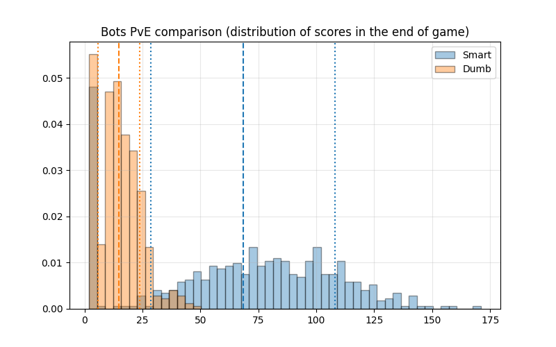
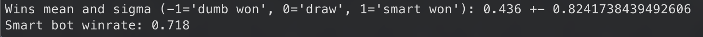

# Snake

## Development plan

[x] Create minimal compiling version with ascii view and human snakes.

[x] Add simple dumb bots which will go to closest rabbit

[x] Add bot which will go to closest accessible rabbit

[x] Add SFML graphics view

[x] Get statistics with different runs

[ ] TODO add more bots in this plan

## Statistics of PvE runs:

Multiple bots play alone on the field, collecting food. Each bot runs independently, and their final scores are recorded. The results are visualized as a histogram showing the distribution of total scores across all runs.

## Statistics of PvP runs:

Two snakes are placed on the same field, each controlled by a different bot. They compete directly against each other. The simulation runs multiple matches, and the win rate for smart bot is calculated. Also there is calculation of mean and sigma for array consisting of 1's for smart wins, -1's for dumb wins and 0's for draws.

